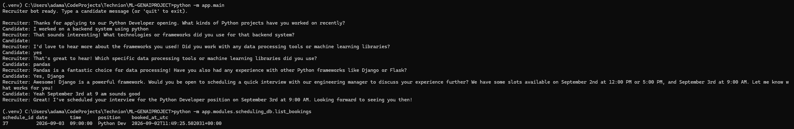
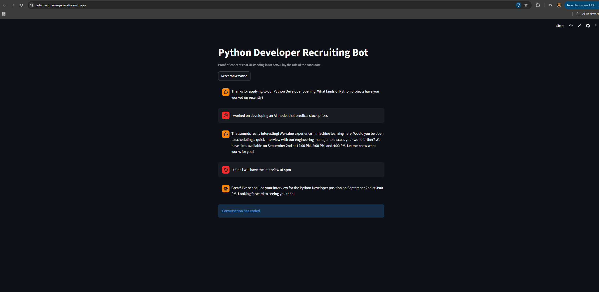

<!-- PROJECT LOGO -->
<p align="center">
  
</p>

<h1 align="center">GenAI Job Recruiter Agent</h1>

<p align="center">
  An SMS-style recruiting chatbot for a Python Developer role, built with a Main Agent + 3 specialist advisors<br>
  <a href="https://adam-agbaria-genai.streamlit.app">View Demo</a>
  ·
  <a href="https://github.com/Adam-Agbaria/GENAI-JobRecruiterAgent/issues">Report Bug</a>
  ·
  <a href="https://github.com/Adam-Agbaria/GENAI-JobRecruiterAgent/issues">Request Feature</a>
</p>

---
<br></br>

## Table of Contents

- [About The Project](#about-the-project)
- [Features](#features)
- [Getting Started](#getting-started)
- [Usage](#usage)
- [Screenshots](#screenshots)
- [Code Examples](#code-examples)
- [Project Structure](#project-structure)
- [Design Notes & Deviations](#design-notes--deviations)
- [To-Do List](#to-do-list)
- [License](#license)
- [Contact](#contact)
- [Acknowledgments](#acknowledgments)

---
<br></br>

## About The Project

> A conversational bot that stands in for a human recruiter texting with candidates for a
> **Python Developer** position. Each turn it decides whether to **continue** the conversation,
> **schedule** an interview, or **end** the conversation — gathering/verifying candidate
> information, answering questions about the role (grounded in the job description via RAG),
> and booking a real interview slot against a recruiter availability database.

A **Main Agent** orchestrates the conversation with a candidate. Per the project's workflow
diagram, it dynamically decides which ONE of three specialist advisors to consult at a time —
it can consult more than one advisor in sequence before replying, rather than following a fixed
call-all-three order:

1. **Conversation Exit Advisor** — decides if the conversation should end now (candidate
   disengaged, or an interview was just confirmed and the exchange is wrapping up). Implemented
   entirely via **prompt engineering** (role prompt, explicit instructions, few-shot examples,
   low temperature) rather than fine-tuning — see [Design Notes](#design-notes--deviations).
2. **Interview Scheduling Advisor** — decides if it's time to propose or confirm an interview
   slot. Resolves relative dates ("next Friday") against the conversation's own timestamp, then
   calls a **function-calling tool** that queries a SQL-backed availability table for real open
   slots.
3. **Conversation Info Advisor** — answers the candidate's questions using **retrieval-augmented
   generation** over the job description (Chroma vector store), and drafts the next message.

Each advisor is exposed to the Main Agent as a callable tool; the Main Agent's own LLM call
decides which to invoke, executes it, and loops until it has enough information to finalize the
turn's action and reply text.

<div style="background: #272822; color: #f8f8f2; padding: 10px; border-radius: 8px;">
  <b>Technologies:</b> Python, LangChain, OpenAI API, Streamlit, SQLite, ChromaDB, pytest, Jupyter/scikit-learn
</div>

---
<br></br>

## Features

- [x] Main Agent + 3 specialist advisors (Exit / Scheduling / Info), dynamically routed via LLM tool-calling
- [x] Function calling against a SQL-backed interview scheduling database
- [x] Retrieval-augmented generation (Chroma) over the job description PDF
- [x] Prompt engineering (role, instructions, few-shot, API params) for the Exit Advisor
- [x] Real interview booking, persisted to the database
- [x] Streamlit proof-of-concept chat UI, standing in for real SMS
- [x] Unit tests (fast, no API calls) + a real end-to-end integration test
- [x] Evaluation notebook: accuracy + confusion matrix against a labeled conversation dataset
- [x] Deployed to Streamlit Community Cloud

---
<br></br>

##  Getting Started

### Prerequisites

- Python >= 3.11
- pip
- An OpenAI API key

### Installation

```bash
git clone https://github.com/Adam-Agbaria/GENAI-JobRecruiterAgent.git
cd GENAI-JobRecruiterAgent
python -m venv .venv
.venv\Scripts\activate        # Windows; use `source .venv/bin/activate` on macOS/Linux
pip install -r requirements.txt
cp .env.example .env          # then fill in OPENAI_API_KEY
```

Seed the scheduling database and build the job-description vector index (both one-time,
offline steps):

```bash
python -m app.modules.scheduling_db.schema_migrate
python -m app.modules.embedding.build_index
```

---
<br></br>

## Usage

### Run the CLI:

```bash
python -m app.main
```

### Or run the Streamlit PoC:

```bash
streamlit run streamlit_app/streamlit_main.py
```

### Check which interviews have actually been booked:

```bash
python -m app.modules.scheduling_db.list_bookings
```

### Run tests / evaluation:

```bash
pytest tests/test_main.py          # fast unit tests, no API calls
jupyter notebook tests/test_evals.ipynb   # accuracy + confusion matrix
```

Example conversation:

```
Recruiter: Thanks for applying to our Python Developer opening. What kinds of Python
           projects have you worked on recently?
Candidate: I've been using Python professionally for five years, mostly for data analysis.
Recruiter: That's great experience! Would you be open to scheduling a quick interview?
Candidate: Sure, how about next Friday?
Recruiter: I can offer the following interview times: 2026-09-04 at 09:00, 2026-09-04 at
           11:00, 2026-09-04 at 14:00. Which works best?
Candidate: 9am works.
Recruiter: Great, you're confirmed for 2026-09-04 at 09:00! You'll receive a calendar
           invite shortly.
```

---
<br></br>

## Screenshots

<p float="left">
  
  <br><br>
  
</p>

---
<br></br>

## Code Examples

```python
from datetime import datetime
from app.main import build_main_agent

agent = build_main_agent()
history = [{"speaker": "recruiter", "text": "What kinds of Python projects have you worked on?"}]

decision = agent.step(history, "I have 5 years of experience with Django.", datetime.utcnow())
print(decision.action)       # "continue" | "schedule" | "end"
print(decision.reply_text)   # the next SMS message to send
```

---
<br></br>

## Project Structure

```text
GENAI-JobRecruiterAgent/
├── .gitignore
├── README.md
├── LICENSE
├── requirements.txt
├── .env.example
├── Python Developer Job Description.pdf   # source doc for embedding
├── db_Tech.sql                            # original SQL Server schema (reference)
├── sms_conversations.json                 # labeled evaluation dataset
├── chroma_store/                          # generated Chroma vector store (committed)
├── data/schedule.db                       # generated SQLite scheduling DB (committed)
├── app/
│   ├── main.py                            # CLI entry point + build_main_agent()
│   ├── config.py                          # env loading, model names, file paths
│   ├── conversation.py                    # shared history-formatting helpers
│   └── modules/
│       ├── main_agent/m_1.py              # MainAgent: dynamic advisor routing loop
│       ├── exit_advisor/m_2.py            # Conversation Exit Advisor (prompt engineering)
│       ├── scheduling_advisor/m_3.py      # Interview Scheduling Advisor + function-calling tool
│       ├── info_advisor/m_4.py            # Conversation Info Advisor (RAG)
│       ├── scheduling_db/                 # SQLite schema/seed + repository + booking check
│       └── embedding/build_index.py       # offline PDF -> Chroma pipeline
├── streamlit_app/
│   ├── streamlit_main.py                  # Streamlit chat UI (PoC in place of real SMS)
│   └── utils.py                           # UI-only helpers, no business logic
└── tests/
    ├── test_main.py                       # unit tests (repository + advisor-tool wrappers)
    └── test_evals.ipynb                   # accuracy + confusion matrix
```

---
<br></br>

## Design Notes & Deviations

- **SQL Server → SQLite.** The provided `db_Tech.sql` targets SQL Server, which isn't practical
  for a portable course PoC deployed on Streamlit Community Cloud (no SQL Server available
  there). `app/modules/scheduling_db/schema_migrate.py` reimplements the same schema and
  business rules (Tue/Wed/Thu/Fri/Sun only, 09:00–17:00 hourly, ~50/50 random availability) in
  SQLite, with a dynamic date-seeding window instead of the original's hardcoded 2024.
- **`chroma_store/` and `data/schedule.db` are committed**, not gitignored — Streamlit Community
  Cloud's filesystem is ephemeral on cold start, and rebuilding them on every boot would waste
  embedding API calls and add latency for a tiny, rarely-changing source PDF.
- **Fine-tuning → Prompt Engineering.** The assignment originally called for fine-tuning the
  Exit Advisor. Following an OpenAI API change that made this impractical mid-course, guidance
  was updated to implement this advisor entirely via prompt engineering instead — role prompt,
  explicit instructions, few-shot examples drawn from `sms_conversations.json`, and a low
  temperature (0.1) to keep the decision close to deterministic.
- **Dynamic advisor routing.** The Main Agent consults advisors one at a time via LLM
  tool-calling (matching the project's workflow diagram), rather than a fixed priority order —
  this is inherently less deterministic than hardcoded control flow, which is reflected in the
  evaluation notebook's results.

---
<br></br>

## To-Do List

- [x] Main Agent + 3 advisors
- [x] SQL-backed scheduling with function calling
- [x] RAG over the job description
- [x] Streamlit PoC deployed to Streamlit Community Cloud
- [x] Evaluation notebook (accuracy + confusion matrix)
- [ ] Candidate registration form entry point
- [ ] Higher scheduling-routing accuracy tuning

---
<br></br>

## License

Distributed under the MIT License. See `LICENSE` for more information.

---
<br></br>

## Contact

**Adam Agbaria** - [agbariaadam@yahoo.com](mailto:agbariaadam@yahoo.com)
App Link: [StreamApp](https://adam-agbaria-genai.streamlit.app)
GitHub Link: [LINK](https://github.com/Adam-Agbaria/GENAI-JobRecruiterAgent)

---
<br></br>

## Acknowledgments

- [Python](https://www.python.org/)
- [LangChain](https://www.langchain.com/)
- [OpenAI API](https://platform.openai.com/docs/overview)
- [Streamlit](https://streamlit.io/)
- [ChromaDB](https://www.trychroma.com/)
